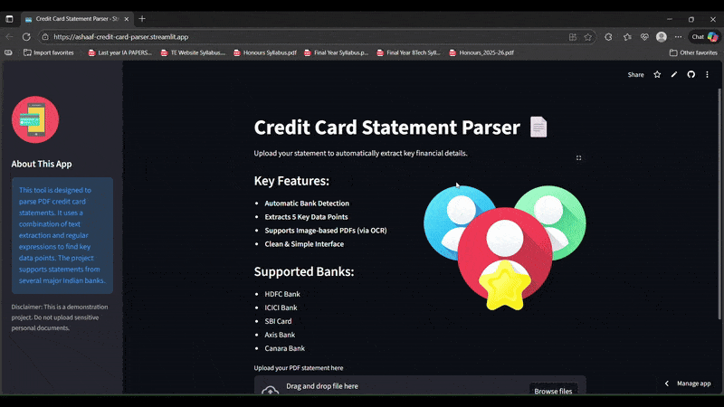
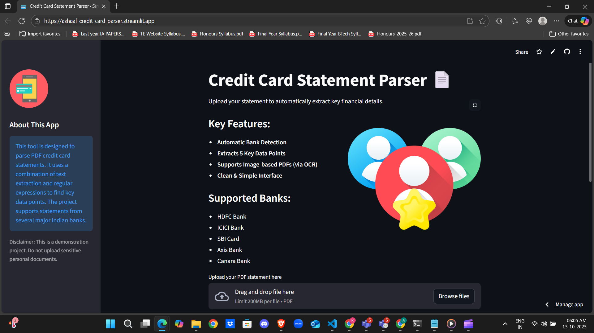
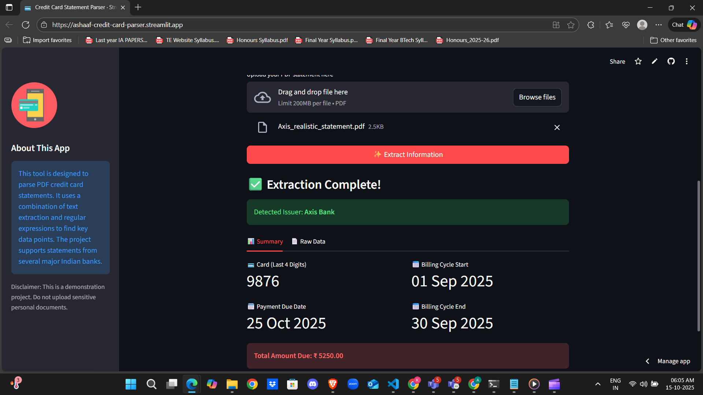
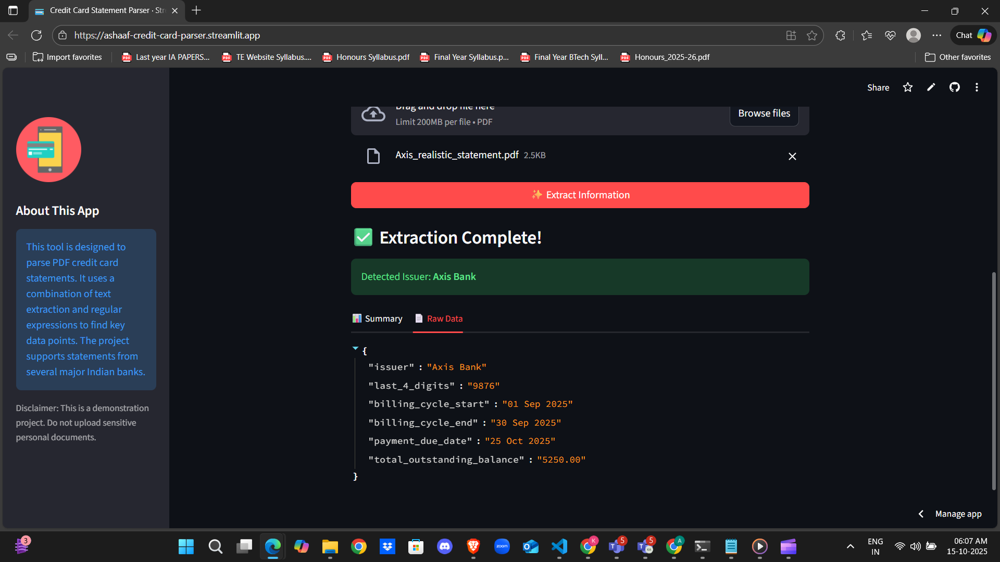

# 💳 Credit Card Statement Parser

A robust web application built with Python and Streamlit that intelligently parses PDF credit card statements to automatically extract key financial information. The application supports multiple banks and includes a powerful OCR fallback to handle scanned or image-based PDFs.

---

### ✨ **[View the Live Deployed Application Here](https://ashaaf-credit-card-parser.streamlit.app)** ✨

---

### 🎬 Project Demo in Action

---

### 🎯 The Goal

The primary objective of this project is to solve a common real-world problem: the tedious and error-prone process of manually extracting data from credit card statements. This tool automates that process, creating a functional, user-friendly application that can handle various PDF formats reliably and present the extracted data in a clean, structured format.

---

### 💡 How It Works: The Parsing Pipeline

The application follows a multi-step process to ensure high accuracy across different types of PDF documents:

1.  **File Upload:** The user uploads a PDF statement via the Streamlit web interface.
2.  **Text Extraction:** The system first attempts to extract text directly using the `pdfplumber` library. This works for digitally generated (structured) PDFs.
3.  **OCR Fallback:** If direct extraction yields no text (indicating a scanned or image-based PDF), the system automatically falls back to an Optical Character Recognition (OCR) pipeline:
    * `pdf2image` converts the PDF pages into images.
    * `pytesseract` scans these images to recognize and extract the text content.
4.  **Bank Identification & Regex Matching:** The extracted text is scanned to identify the issuing bank. Based on the bank, a set of tailored Regular Expressions (regex) are applied to find and extract the specific required data points (card number, due date, etc.).
5.  **Display Results:** The extracted information is sent back to the Streamlit frontend and displayed to the user in a clean, organized summary.

---

### 📸 Screenshots

**Application Homepage**

**Successful Data Extraction (Summary & Raw Data Views)**

---

### 🌟 Key Features

-   **Dual Parsing Engine:** Combines direct text extraction with a powerful OCR fallback for maximum compatibility.
-   **Automatic Bank Detection:** Intelligently identifies the issuer (HDFC, ICICI, SBI, etc.) from the statement.
-   **Precise Data Extraction:** Uses custom regex patterns to accurately pull 5 key data points.
-   **Polished & Intuitive UI:** A clean, responsive, and easy-to-use interface built with Streamlit.
-   **Cloud-Native:** Designed for cloud deployment, with system dependencies managed for seamless setup.

---

### 🛠️ Technology Stack

-   **Backend:** Python
-   **Frontend:** Streamlit
-   **PDF Parsing:** `pdfplumber` for structured PDFs.
-   **OCR Engine:** `pytesseract` (a Python wrapper for Google's Tesseract-OCR).
-   **PDF-to-Image Conversion:** `pdf2image` (utilizing the Poppler utility).
-   **Deployment:** Streamlit Community Cloud.

---

### 🧗 Challenges & Learnings

-   **Handling Diverse PDF Formats:** The biggest challenge was creating a single tool that could handle both digitally generated PDFs and scanned, image-based PDFs. Implementing the OCR fallback was the key learning and solution.
-   **Deployment Dependencies:** Deploying an app that relies on system-level software (Tesseract and Poppler) is complex. **Solution:** This was solved by creating a `packages.txt` file in the repository, which instructs the Streamlit Cloud deployment server to install these crucial system dependencies before running the Python code.
-   **Regex Specificity:** Crafting regular expressions that are specific enough to avoid false positives but general enough to handle minor formatting changes in statements was a significant part of the development process.

---

### 🚀 Future Enhancements

-   **Support for More Banks:** Integrating regex patterns for a wider range of national and international banks.
-   **Transaction Table Parsing:** Expanding the parser to extract and itemize the list of individual transactions.
-   **Data Visualization:** Adding a dashboard to create charts and graphs based on spending categories from the extracted transactions.
-   **Password-Protected PDFs:** Implementing a feature to allow users to input a password to parse encrypted statements.

---

### 🧪 **Testing the Application**

For the best experience and a guaranteed successful demonstration of the parsing capabilities, it is highly recommended to **use the sample statements provided within this repository**.

You can find them in the `samples/` directory or download them directly from [this link](https://github.com/ashaafkhan/credit-card-parser/tree/main/samples). The parser has been specifically tailored and tested against these formats.

---

